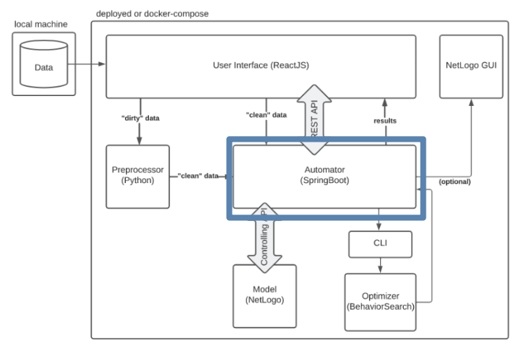

# Automator
The “Automator” will function as a backend in our system. It takes in the clean data in csv form and lets the model run using that data via the controlling API. It also connects to the “Optimizer” via the CLI. It is connected to the User Interface of our system over a REST API.



## To Run
To run the application:\
```mvn spring-boot:run``` in terminal or run from ```AutomatorApplication.java``` using IDE created "run" button

To run the services:\
```curl localhost:8080``` in a separate terminal window or open 'localhost:8080/*command*' in browser

To run executable .jar:\
In terminal navigate to .../automator and run ```java -jar target/automator-0.0.1-SNAPSHOT.jar``` (might be Windows specific)

To run in Docker container:\
Open Docker Desktop app.\
In terminal navigate to .../automator and run ```docker build -t automator .```. This builds the Docker image based on the Dockerfile in the automator directory.
Then run ```docker run -it -p 8080:8080 automator```. This starts up the Docker container.

Functionality:\
The .jar can be executed on Windows as well as UNIX-based operating systems. The docker container can be run on any operating system with docker installed.


## How to make changes
Whenever the Java-code is changed, delete old .jars in the target folder and re-package the code using maven (should be possible in all IDEs, for me IntelliJ worked best).
Then rebuild Docker image to apply the changes.

## License
This work is licensed under [CC BY-NC-SA 4.0](https://creativecommons.org/licenses/by-nc-sa/4.0/?ref=chooser-v1).